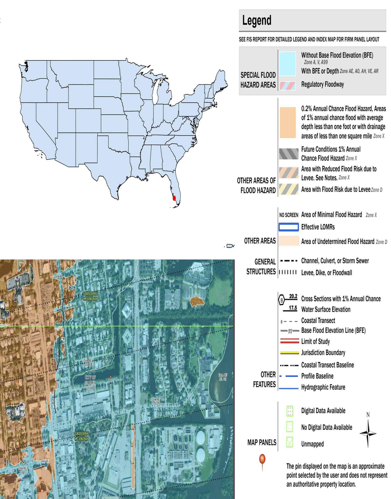
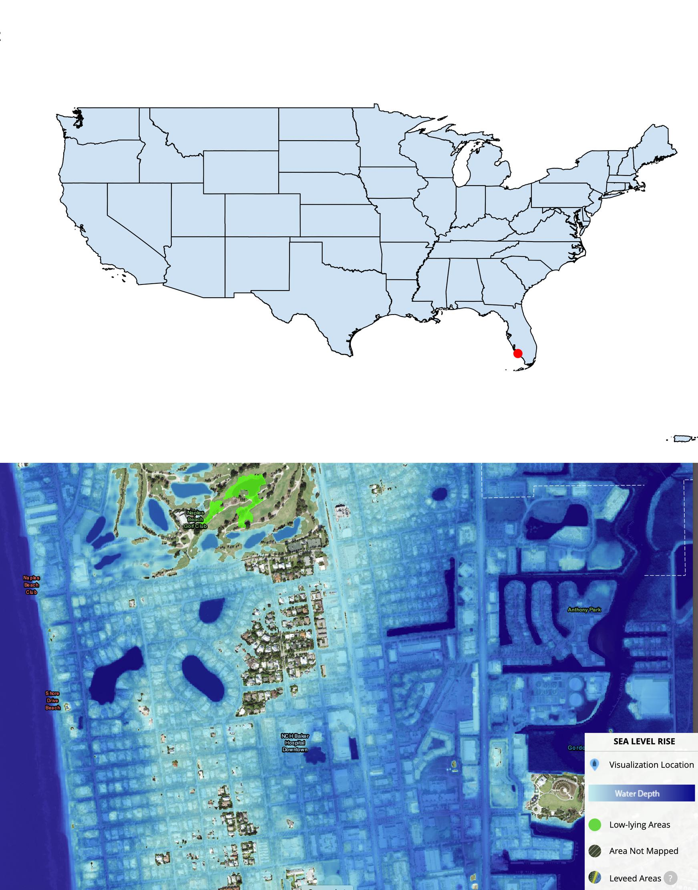
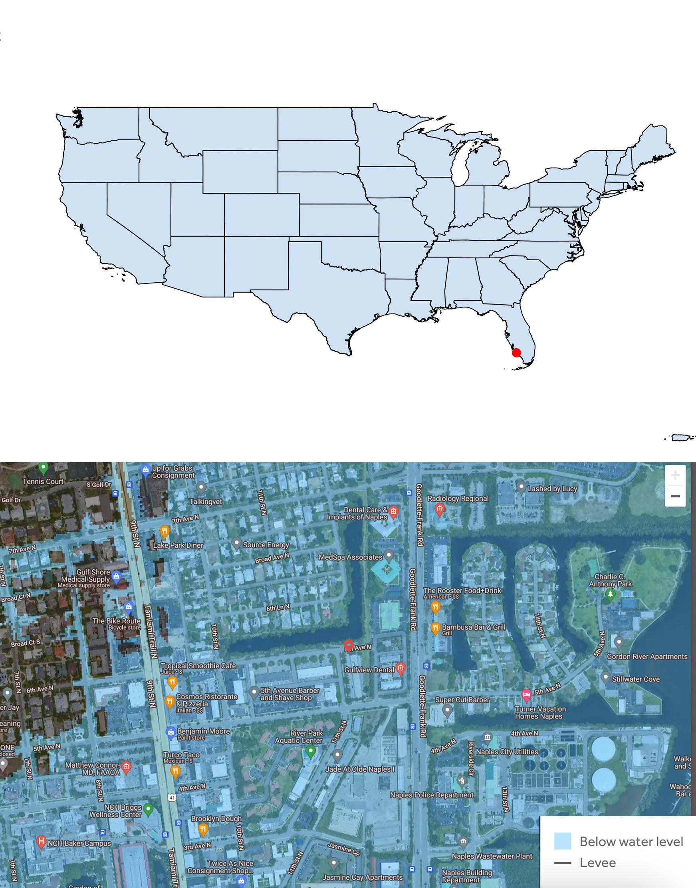
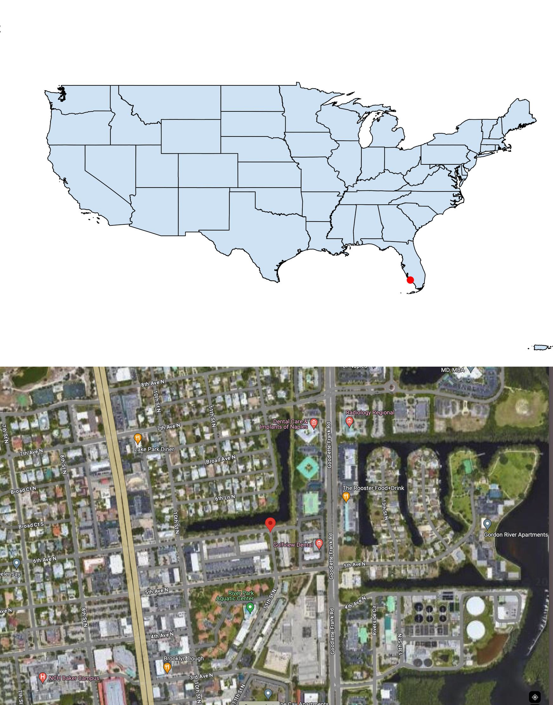
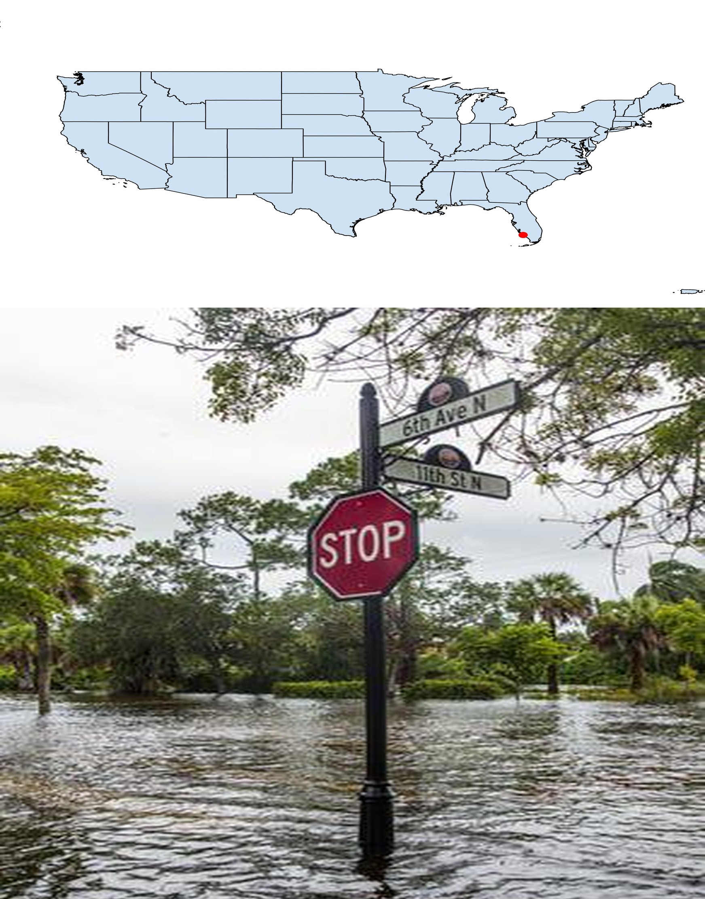

# The FLOODPERCEP Dataset: Flood Hazard Maps and Imagery for Studying Human Perception of Flood Risk  

## **Table of Contents**
1. [Introduction](#introduction)
2. [Implementation](#implementation)
3. [Dataset](#dataset)
4. [Tutorials](#tutorials)

## **Introduction**
The FLOODPERCEP dataset is a curated collection of visual materials and survey data designed to study how people perceive the risk of flood when exposed to different types of visual information. The dataset combines flood hazard maps from trusted sources, such as the Federal Emergency Management Agency (FEMA), National Oceanic and Atmospheric Administration (NOAA), and Climate Central along with historical flood imagery and Google Maps views of the same locations. 

This dataset supports research on risk perception and climate communication by providing both the stimuli (images/maps) and responses (survey data) used to evaluate how individuals interpret and respond to visual representations of flood hazards. The complete dataset can be downloaded [here.](https://drive.google.com/drive/folders/1Uf5tJTTFd1L7A_CjPhPyGcB0lzcy1CWy)  

The study was conducted with approval from the University of Colorado Boulder's Institutional Review Board (IRB Protocol #24-0438) and involved 796 U.S. participants recruited via Amazon Mechanical Turk (MTurk). Each participant was randomly assigned to one of five visualization types: FEMA, NOAA, Climate Central, Google Maps, or Historical Images and completed a standardized questionnaire measuring their understanding, confidence, and behavioral intentions related to flood risk. 


### **Sample Visualizations**

As an example, below is a set of five flood visualizations corresponding to location 5 in the FLOODPERCEP dataset. The dataset contains a total of 260 unique U.S. locations.

<table align="center">
  <tr>
    <td align="center">
      <br>
      <b>FEMA</b>
    </td>
    <td align="center">
      <br>
      <b>NOAA</b>
    </td>
    <td align="center">
      <br>
      <b>Climate Central</b>
    </td>
    <td align="center">
      <br>
      <b>Google Maps</b>
    </td>
    <td align="center">
      <br>
      <b>Historical Images</b>
    </td>
  </tr>
</table>
Each visualization corresponds to the same geographic location, represented through five different information sources. 


## **Dataset**

### **Dataset Overview**


The FLOODPERCEP dataset consists of two main CSV files stored in the `data/` directory. In addition, a small set of flood visualizations shown to participants are organized within the `sample/` directory. 

---

### **1. `mturk_data.csv`**

This file contains participant survey responses collected via Amazon Mechanical Turk (MTurk).  

Each row represents responses from one participant. 

The file includes: 
- **Demographic information** (age, gender, ethnicity, race, education, and language)  
- **Flood experience** (previous flood encounters, preparation and response actions)  
- **Perception metrics** based on Likert-scale questions evaluating risk severity, confidence in the map, and behavioral intentions  

---

### **2. `image_meta_data.csv`**

This file contains metadata for all historical flood images used in the study. 

Each row corresponds to one image and documents its source, geographical location, and contextual details. 

The file includes: 
- **Geographical attributes** such as longitude, latitude, city, state, and U.S. ZIP code  
- **Web links** to reference news articles and corresponding Google Street View locations  
- **Optional notes** describing the flood event, capture date, and any additional observations   

`image_meta_data.csv` links directly with the participant dataset using the `Image File Name` column.


---

### **3. Flood Visualizations**

In addition to the CSV files, the `sample/` directory contains a small set of flood visualizations used in the survey. 

These are organized into five folders, one for each visualization type. 

Each folder contains five samples, corresponding to locations 1 - 5 of the 260 unique flood locations included in the complete dataset. 

The complete set of flood visualizations can be downloaded [here.](https://drive.google.com/drive/folders/1EGKS0LJrxAFtNmn7g5idX6pHedCaXDED)


#### **Folder Structure**

```
sample/
│
├── fema/
│   ├── location_1.png
│   ├── location_2.png
│   └── ...
│
├── noaa/
│   ├── location_1.png
│   ├── location_2.png
│   └── ...
│
├── climate-central/
│   ├── location_1.png
│   ├── location_2.png
│   └── ...
│
├── google-maps/
│   ├── location_1.png
│   ├── location_2.png
│   └── ...
│
└── historical-images/
    ├── location_1.png
    ├── location_2.png
    └── ...
```

---

### **4. Data Dictionary**

The file [`data/data_dictionary.pdf`](data/data_dictionary.pdf) provides descriptions of all columns in the two CSV files: `mturk_data.csv` and `image_meta_data.csv`.
It includes two tables:

1.	MTurk Data Table – describes the columns in the participant survey dataset.
2.	Image Metadata Table – describes the columns in the image metadata dataset.

This file serves as a quick reference for understanding the structure and meaning of each column in both datasets.


### **5. Survey**

The survey instruments used in this study, available in both English and Spanish languages, are provided as part of the dataset. These documents include all participant instructions, demographic questions, visualization prompts, and Likert scale items used in the analysis. 

The survey (in English and Spanish languages) can be downloaded [here.](https://drive.google.com/drive/folders/1ayVVvuNrLUgNkr8_4UoATP3Ly9sxC6Bn)  

<!-- ### **MTurk Data Dictionary**

| **Data Field** | **Description** |
|----------------|-----------------|
| `participant_ID` * | Encoded Amazon MTurk respondent ID |
| `participant_longitude` * | Participant’s geographic longitude coordinate |
| `participant_latitude` * | Participant’s geographic latitude coordinate |
| `participant_zip_code` | Self-reported participant ZIP code |
| `participant_city` * | Participant’s city (derived from ZIP code) |
| `participant_state` * | Participant’s state (derived from ZIP code) |
| `age` | Participant’s age range (multiple choice) |
| `gender` | Participant’s gender |
| `hispanic_or_latino` | Ethnicity identification |
| `race` | Participant’s race category (multiple choice) |
| `race_self_identify_text` | Self-described race (optional) |
| `education_level` | Highest education completed |
| `languages_home` | Languages spoken at home |
| `languages_home_other` | Other specified languages (optional) |
| `last_flood_experience` | Most recent flood experience (year) |
| `flood_preparation_actions` | Actions taken before a flood (multiple choice) |
| `flood_response_actions` | Actions taken during a flood (multiple choice) |
| `flood_map_experience` | Prior experience using flood maps |
| `flood_map_experience_other` | Other map experience details (optional) |
| `visualization_source` * | Selected folder name (one of five visualization sources) |
| `selected_image` * | Flood image file shown from the selected folder |
| `image_latitude` * | Flood image’s geographic latitude coordinate |
| `image_longitude` * | Flood image’s geographic longitude coordinate |
| `image_zip_code` * | Flood image location ZIP code |
| `image_city` * | Flood image source city |
| `image_state` * | Flood image source state |
| `flood_risk_severity` | Perceived flood risk from image *(Likert scale 1–5)* |
| `flood_frequency` | Perceived flood occurrence rate (in years) |
| `flood_risk_understanding` | Understanding of flood risk *(Likert scale 1–5)* |
| `confidence_in_map` | Confidence in image accuracy *(Likert scale 1–5)* |
| `likely_to_buy_property` | Likelihood of buying property *(Likert scale 1–5)* |
| `likely_to_rent_property` | Likelihood of renting property *(Likert scale 1–5)* |
| `likely_to_buy_insurance` | Likelihood of buying insurance *(Likert scale 1–5)* |
| `likely_to_take_preventive_actions` | Likelihood of taking preventive actions *(Likert scale 1–5)* |
| `use_flood_maps_frequency` | Frequency of using flood maps *(Likert scale 1–5)* |
| `ease_of_interpretation` | Ease of reading and interpreting the map *(Likert scale 1–5)* |
| `additional_comments` | Open-ended participant comments (optional) |

---

### **Historical Image Metadata Dictionary**

| **Data Field** | **Description** |
|----------------|-----------------|
| `Image File Name` | Unique identifier for the image entry in the dataset |
| `Country` | Country where the flood occurred *(U.S., for this dataset)* |
| `State` | U.S. state where the event image was taken |
| `City` | City where the image was taken |
| `zipcode` * | 5-digit postal code of the flood location |
| `Longitude` | Geographic longitude coordinate |
| `Latitude` | Geographic latitude coordinate |
| `Flood Name` | Name of the flood event *(if known)* |
| `Date Taken` | Date the image was originally captured |
| `Comment` | Notes about the scene or context |
| `Web Link (Images)` | Link to the related news story or reference documentation |
| `Web Link (Google Street View)` | Link to the corresponding Google Street View of the same location under normal conditions | -->


## **Implementation**

### Dependencies
- `python`
- `numpy`
- `pandas`
- `matplotlib`
- `seaborn`
- `geocode`

## **Tutorials**

The repository includes two interactive tutorials that demonstrate how to explore, visualize, and enrich the FLOODPERCEP dataset. 

### **1. Data Visualization & Distribution Analysis**
**Notebook:** `tutorials/data_visualization.ipynb`  

This tutorial walks through basic data exploration and visualization using the participant survey data (`mturk_data.csv`).  
It includes:
- Summary statistics of participant demographics and responses  
- Geographical distribution of images by visualization type   
- Heatmaps and interactive boxplots showing perception score variations by visualization type 

The goal of this tutorial is to help users quickly understand the dataset structure and variability across visualization categories. 

---

### **2. ZIP Code, City, and State Extraction**
**Notebook:** `tutorials/geolocation_extraction.ipynb`  

This tutorial focuses on geographical data processing for both the image metadata (`image_meta_data.csv`) and participant dataset (`mturk_data.csv`).  
It demonstrates how to:
- Extract **city** and **state** from ZIP codes using `pgeocode`
- Derive **ZIP codes from  longitude and latitude** using `geopy`

---